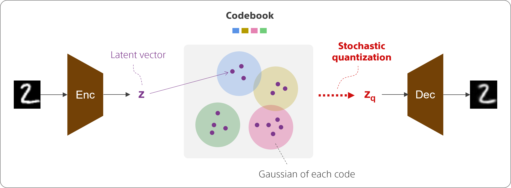
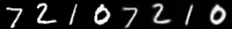

# Minimal-SQVAE
A minimal Pytorch implementation of "**SQ-VAE: Variational Bayes on Discrete Representation with Self-annealed Stochastic Quantization**" by Sony.

- Paper (arxiv) : [SQ-VAE: Variational Bayes on Discrete Representation with Self-annealed Stochastic Quantization](https://arxiv.org/abs/2205.07547)
- Official codes : [sony/sqvae](https://github.com/sony/sqvae)



# Summary

This repository provides a simple implementation of SQ-VAE which extends the standard VAE via stochastic dequantization and quantization.

This repository includes:
* Architecture : Conv/ResNet-based encoder and decoder with stochastic quantizer
* Training codes with MNIST dataset

Let's boost your VQ-VAEs application by using SQ-VAE.

# Requirements
- Python 3.8.*
- numpy **
- pytorch **
- torchvision **
- tensorboard **
- tqdm **

# Training

Make sure to download the MNIST dataset.

## 1) Hyperparameters
Specify hyperparameters inside a .yaml file, e.g.:

```yaml
# resize MNIST from 28 to 32
# to apply hier compression
data_resize: 32 

batch_size: 128
lr: 0.001
beta_1: 0.0
beta_2: 0.99
num_epoch: 100
temperature_decay: 0.00001

encdec:
    in_ch: 1 # MNIST
    width: 8
    depth: 2
    num_down: 4 # compression -> 2^4=16
    stride: 2

quantizer:
    size_dict: 32
    dim_dict: 8
    var_q_init: 5.
```


## 2) Train the model

```bash
python train_gan.py --datadir <path_to_mnist> --jobname <job_name>
```

To see more options:
```bash
python train_gan.py -h
```


# Results

- Input size : 32 x 32 (resized from 28 x 28)
- Codebook size : 32
- Latent size : 2 x 2

## Reconstruction samples (after 100 epochs)
Left half -> input images / Right half -> reconstruction images




# Citation
[1] Takida, Y., Shibuya, T., Liao, W., Lai, C., Ohmura, J., Uesaka, T., Murata, N., Takahashi S., Kumakura, T. and Mitsufuji, Y.,
"SQ-VAE: Variational Bayes on Discrete Representation with Self-annealed Stochastic Quantization,"
39th International Conference on Machine Learning.
```
@INPROCEEDINGS{takida2022sq-vae,
    author={Takida, Yuhta and Shibuya, Takashi and Liao, WeiHsiang and Lai, Chieh-Hsin and Ohmura, Junki and Uesaka, Toshimitsu and Murata, Naoki and Takahashi, Shusuke and Kumakura, Toshiyuki and Mitsufuji, Yuki},
    title={{SQ-VAE}: Variational Bayes on Discrete Representation with Self-annealed Stochastic Quantization},
    booktitle={International Conference on Machine Learning},
    year={2022},
    }
```